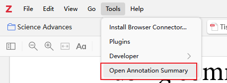
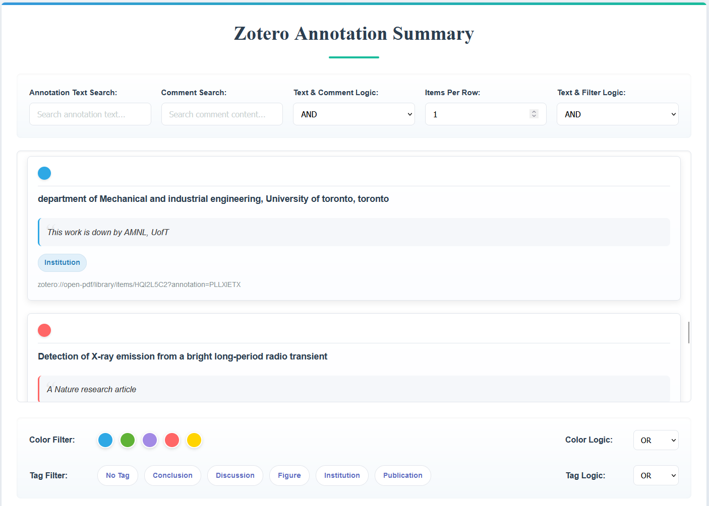
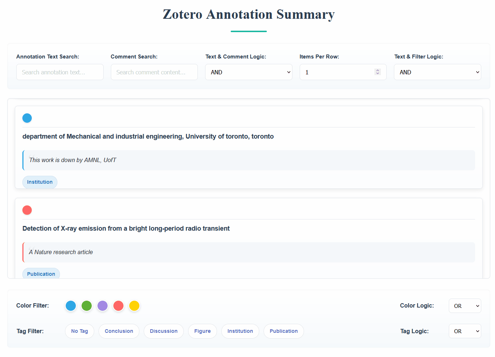
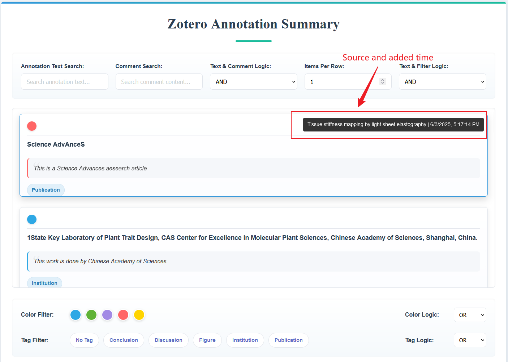
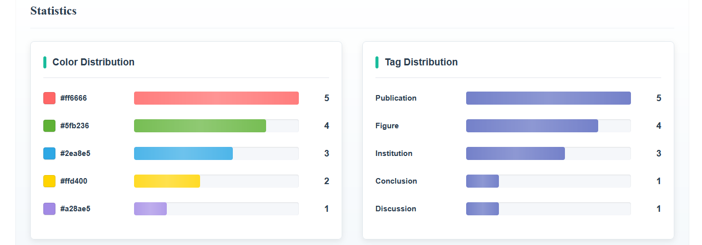

# Zotero Annotation Summary Viewer

> [简体中文](./README.md) | [English](./README_en.md)

## 简介

一个基于用于在 Zotero 显示文库中标注总结的插件。 可以加载并展示文库中的注释，支持按检索词检索、按颜色/标签过滤、鼠标悬浮预览来源和时间，点击直接跳转以及简易数据统计功能。

## 使用方式

- 安装[Release](https://github.com/OneOneLiu/zotero-annotation-summary/releases)中的`annotation-summary.xpi`插件到Zotero 7
- 在 Zotero 顶部菜单栏，工具->打开标注总结

## 功能

- 将从 Zotero 中的annotation加载并展示到一个总结页面中。

### 2. 搜索与过滤

- 按注释内容或评论关键字搜索。
- 可选与或非逻辑

- 按注释颜色与标签进行二次筛选。
- 支持组合逻辑（AND、OR、NOT），可灵活控制搜索/过滤关系。

### 3. 鼠标悬浮预览来源与时间

- 在鼠标悬停时，右上角浮层自动显示该注释的来源文献标题 (sourceTitle) 与添加时间 (dateAdded)。

### 4. 点击打开注释对应来源文献

- 点击任意注释条目会触发超链接，自动在 Zotero 中跳转到对应标注。

### 5. 数据统计

- 页面下方显示color和tag直方图数据统计

### 6. 动态渲染 UI

- 根据当前筛选状态，动态更新注释列表、可选标签，颜色面板，和数据统计。

## 许可证

本项目采用 **[AGPL-3.0](https://www.gnu.org/licenses/agpl-3.0.en.html)** 许可证。详情请参阅 [LICENSE](https://github.com/OneOneLiu/zotero-annotation-summary/blob/master/LICENSE) 文件。

---

## 致谢

- 本项目基于 **[Zotero Plugin Template](https://github.com/windingwind/zotero-plugin-template)** 构建  
- 本项目参考了 [Chartero](https://github.com/volatile-static/Chartero) 源码