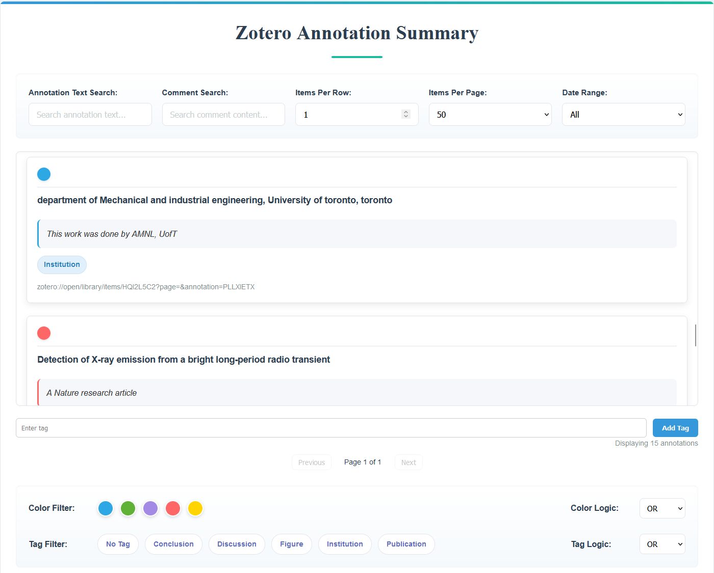
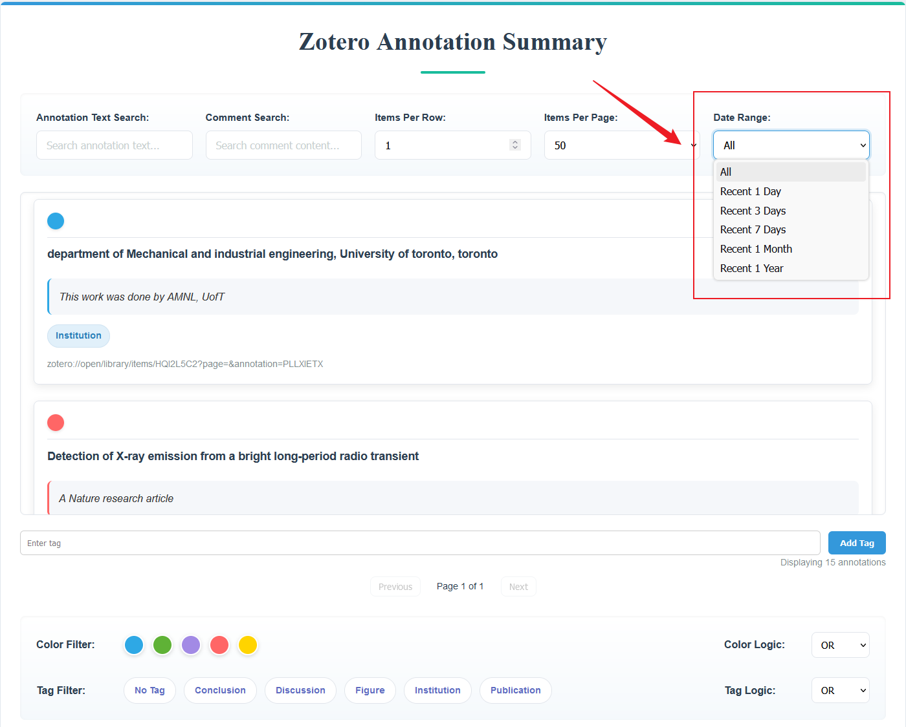
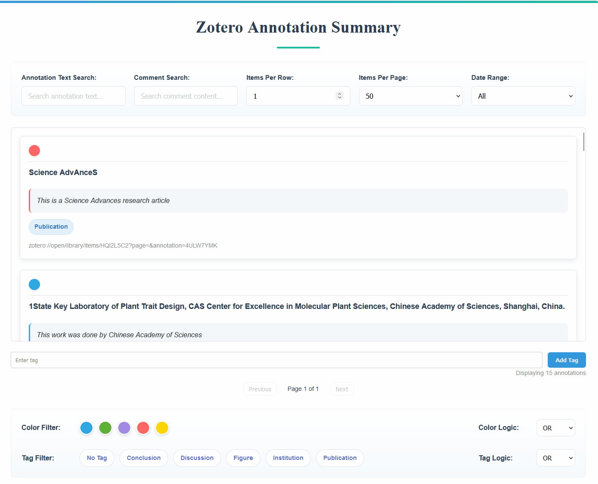
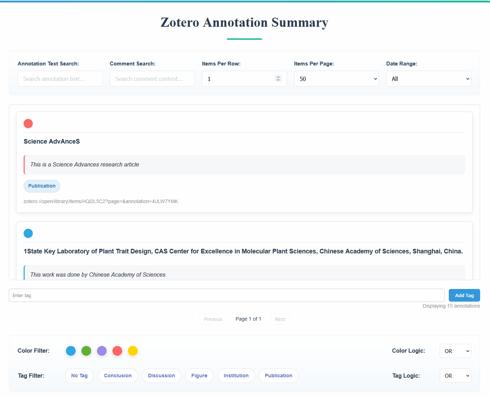

# Zotero Annotation Summary

> [简体中文](./README.md) | [English](./README_en.md)

## 简介

一个用于在 Zotero 中提取，显示文库中所有标注的插件。 可以加载并展示文库中的所有标注，支持按检索词检索、按颜色/标签过滤、删除/批量添加标注的标签、鼠标悬浮预览来源和时间、点击直接跳转以及简易数据统计功能。

## 使用方式

- 安装[Release](https://github.com/OneOneLiu/zotero-annotation-summary/releases)中的`annotation-summary.xpi`插件到Zotero 7
- 在 Zotero 顶部菜单栏，工具->打开标注总结

## 功能

### 1. 加载展示标注
- 将从 Zotero 中的高亮标注加载并展示到一个总结页面中。

### 2. 搜索与过滤

- 按标注高亮内容或评论关键字搜索。

- 按标注颜色与标签进行二次筛选。

- 颜色与标签筛选支持NOT逻辑，可以从所有标注数据中剔除某些颜色或者标签的标注。

> [!note]
> - 与逻辑没有作用，将在未来版本移除
> - OR 逻辑的UI交互有些小bug，无法同时选中多个颜色/标签，将在未来版本解决。现在可以通过选择NOT->选择多个颜色/标签->然后改回OR实现多颜色/标签OR逻辑

- 支持按照日期过滤，过滤日期可选最近一天至一年，或者显示全部

### 3. 鼠标悬浮预览来源与时间

- 在鼠标悬停时，右上角浮层自动显示该标注的来源文献标题 (sourceTitle) 与添加时间 (dateAdded)。

### 4. 点击打开标注对应来源文献

- 双击任意标注条目会触发超链接，自动在 Zotero 中跳转到对应标注。

> [!note]
> - `PDF`文件可以跳转到标注位置，而`epub`文件由于没有页码，只能跳转到对应文件，其他文件并未测试。
> - 最新的Zotero 7 Beta版本支持跳转到`epub`指定标签位置。

### 5. 数据统计

- 标注数据窗格右下方显示当前显示的标注总条目

- 页面下方显示color和tag的直方图数据统计

### 6. 删除/（批量）添加标签到标注
- 将鼠标移至条目下侧显示的标签上，该标签右侧会浮现删除按钮，点击即可删除该标签

- 点击每个标注条目左上角的圆形颜色图块可以选中该条目，在标注区域下方可以输入并添加标签到该条目
- 支持选中多个条目批量添加标签

### 7. 动态渲染 UI

- 根据当前筛选状态，动态更新标注列表、可选标签，颜色面板，和数据统计。

### 8. 更新版本
- 本插件未提供内置自动更新功能。
- 本插件已被[Zotero 插件合集](https://github.com/zotero-chinese/zotero-plugins)收录，使用[zotero-addons](https://github.com/syt2/zotero-addons#readme)插件，打开自动更新可自动更新本插件。

## 许可证

本项目采用 **[AGPL-3.0](https://www.gnu.org/licenses/agpl-3.0.en.html)** 许可证。详情请参阅 [LICENSE](https://github.com/OneOneLiu/zotero-annotation-summary/blob/master/LICENSE) 文件。

---

## 致谢

- 本项目基于 **[Zotero Plugin Template](https://github.com/windingwind/zotero-plugin-template)** 构建。
- 本项目参考了 [Chartero](https://github.com/volatile-static/Chartero) 源码。
