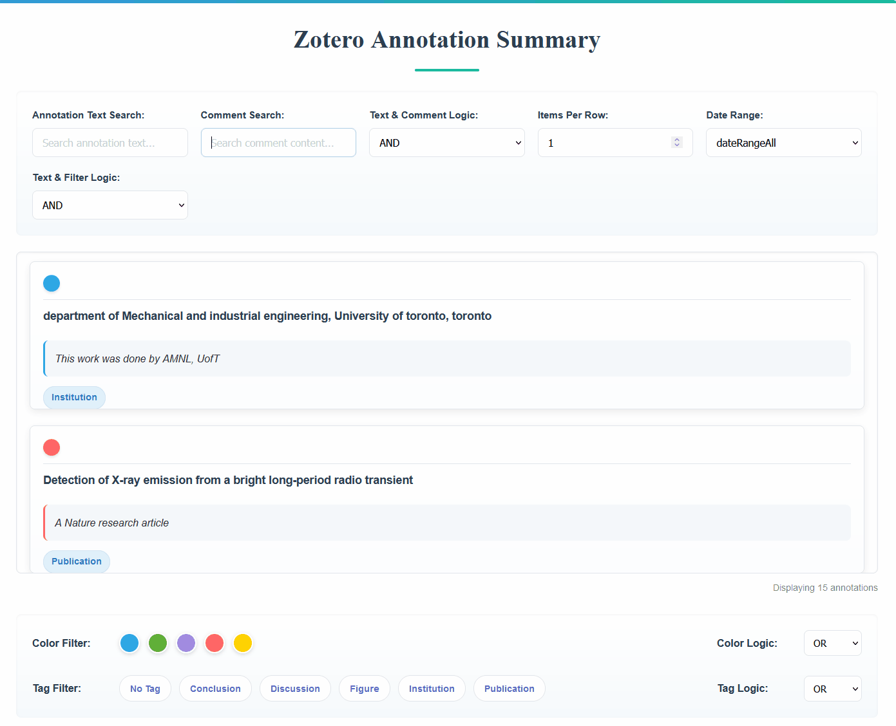
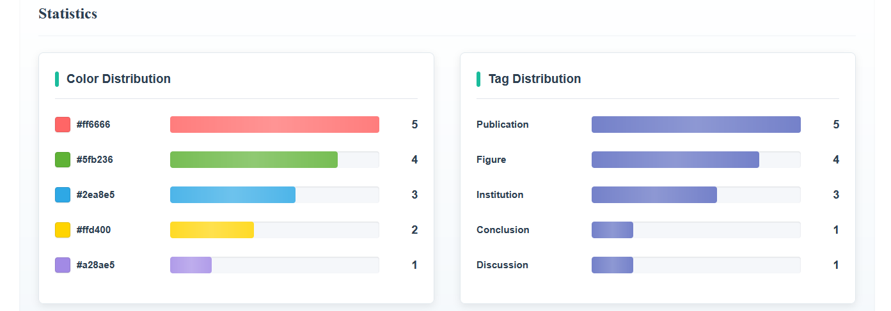

# Zotero Annotation Summary Viewer

  
  
  
  
  

> [简体中文](./README.md) | [English](./README_en.md)

## Introduction

**Zotero Annotation Summary Viewer** is a plugin that loads and displays all annotations (highlights, notes, etc.) from your Zotero library in a single summary page. It supports keyword searches, color/tag filtering, hover previews of source information and timestamps, direct hyperlink jumps to the original annotation in Zotero, and basic data statistics.

---

## How to Use

1. **Install the Plugin**  
   - Download the latest `annotation-summary.xpi` from the [Releases page](https://github.com/OneOneLiu/zotero-annotation-summary/releases) and install it into Zotero 7.

2. **Open the Annotation Summary**  
   - In Zotero’s top menu bar, go to **Tools → Open Annotation Summary**.

   

---

## Features

### 1. Load and Display Annotations

- The plugin automatically loads every annotation (highlights, notes, etc.) from your Zotero library and displays them in a unified summary page.

  

---

### 2. Search & Filter

- **Keyword Search**  
  - Search annotations by text or by comment keywords.
  - Supports Boolean logic operators: **AND**, **OR**, **NOT**.

  

- **Color & Tag Filtering**  
  - Filter annotations by highlight color or by custom tags.
  - You can combine filters (AND, OR, NOT) for precise control.

  

---

### 3. Hover Preview: Source & Timestamp

- When you hover over an annotation entry, a tooltip appears in the top-right corner displaying the source item’s title (`sourceTitle`) and the date the annotation was added (`dateAdded`).

  

---

### 4. Click to Jump to Original Annotation

- Clicking on any annotation entry will open the corresponding source item in Zotero and scroll directly to that annotation.

  

---

### 5. Data Statistics

- At the bottom of the page, color and tag histograms display basic statistics about your annotations:
  - How many annotations use each color.
  - How many annotations belong to each tag.

  

---

### 6. Dynamic UI Rendering

- The annotation list, available tags, color palette, and data statistics all update in real time as you apply new filters or modify the search query. This ensures you always see only the relevant subset of annotations.

---

## License

This project is licensed under the **[AGPL-3.0](https://www.gnu.org/licenses/agpl-3.0.en.html)**. See the [LICENSE](https://github.com/OneOneLiu/zotero-annotation-summary/blob/master/LICENSE) file for details.

---

## Acknowledgments

- Built using the **[Zotero Plugin Template](https://github.com/windingwind/zotero-plugin-template)**
- Inspired by and referencing the source code of **[Chartero](https://github.com/volatile-static/Chartero)**
