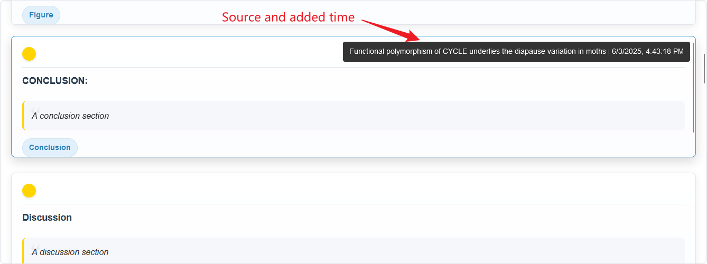

# Zotero Annotation Summary

> [简体中文](./README.md) | [English](./README_en.md)

## Introduction

A Zotero plugin that extracts and displays all highlights and notes from your library in a unified summary page. You can load and view every annotation, search by keyword, filter by color or tag (including NOT logic), delete and batch add tags to annotations, hover to preview source and timestamp, click to jump directly to the corresponding item in Zotero, and view simple statistics.

## How to Use

1. Download and install `annotation-summary.xpi` from the [Release page](https://github.com/OneOneLiu/zotero-annotation-summary/releases) into Zotero 7.
2. In Zotero’s top menu bar, go to **Tools → Open Annotation Summary**.

## Features

### 1. Load and Display All Annotations

— Load all highlight annotations (and their comments) from your Zotero library into a summary page that dynamically updates as you filter or search.

### 2. Search & Filter

- **Text/Comment Search**  
  Search by highlight text or comment keywords. Supports AND, OR, and NOT logic.

  

- **Color & Tag Filtering**  
- Filter annotations by highlight color or tag. Supports 
- NOT logic: selecting NOT plus a color or tag excludes any annotation with that color/tag.

    

> - "And" logic is useless and will be removed in future version.
> - There is a bug between the "OR" logic and UI, where only one colors/tag can be selected, multiple colors/tags selection will be provided in future version. As a workaround to realize "OR" logic: Set "NOT" logic -> choose multiple colors/tags -> Set back to "OR" logic.

- **Date Range Filtering**  
  Choose a preset date range, from Recent 1 Day” up to “Recent 1 Year,” or show all annotations.

  

### 3. Hover to Preview Source & Timestamp

Hover over any annotation to see a small overlay in the top-right corner showing the source title (`sourceTitle`) and the time it was added (`dateAdded`).

### 4. Click to Jump to Zotero Item

Double click any annotation entry to open its corresponding item in Zotero at the exact highlighted location.

> [!note]
> - This click-to-junp feature can jump to the annotation page with PDF items, but can only jump to the item when with epub items because epub does not have pages. Other items have not been tested.
> - The newest Zotero 7 Beta version supports jump to annotation positions with epub.

### 5. Display Count & Statistics

- **Display Count**  
  At the bottom of the annotation list, a line shows how many annotations are currently displayed.  

  

- **Color & Tag Histograms**  
  At the bottom of the page, two histograms show the distribution of annotation counts by color and by tag, updating dynamically as you filter.

  

### 6. delete/(batch) add tags
- Hover the mouse onto the tags shown on the lower part of annotation items, a delete icon will show up and the tag can be deleted by a single click.

- Click the color circle on the left top of an annotation item to select it, then you can add tags to it using the input box and button below.
- Multiple items can be select for batch addition of tags

### 7. Dynamic UI Rendering

Everything updates in real time based on the current filter state:  
- The list of annotations  
- Available tag and color options (including excluded items marked with a red line)  
- Display count text  
- Histograms

### 8. Update
- This plugin does not provide automatic updating feature。
- This plugin has been included in [Zotero Plugins Collection](https://github.com/zotero-chinese/zotero-plugins), and can be automatically updated using the [zotero-addons](https://github.com/syt2/zotero-addons#readme) plugin.

## License

This project is licensed under **[AGPL-3.0](https://www.gnu.org/licenses/agpl-3.0.en.html)**. See the [LICENSE](https://github.com/OneOneLiu/otero-annotation-summary/blob/master/LICENSE) file for details.

---

## Acknowledgments

- Built on the **[Zotero Plugin Template](https://github.com/windingwind/zotero-plugin-template)**  
- Inspired by and referencing [Chartero](https://github.com/volatile-static/Chartero) source code  
